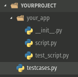

[](https://travis-ci.com/JBthePenguin/TestCasesExecutor) [](https://www.codacy.com/manual/JBthePenguin/TestCasesExecutor?utm_source=github.com&amp;utm_medium=referral&amp;utm_content=JBthePenguin/TestCasesExecutor&amp;utm_campaign=Badge_Grade)   [](https://www.python.org/downloads/) [](https://www.gnu.org/licenses/gpl-3.0)
## TestCasesExecutor
:exclamation::exclamation::exclamation:***IN PROGRESS***:exclamation::exclamation::exclamation:

Execute TestCases ordered by group (configuring before), display human readable result in cli and generate a html file report.

### Install
```sh
$ pip install git+https://github.com/JBthePenguin/TestCasesExecutor.git
```
This also install [Jinja2](https://palletsprojects.com/p/jinja/) used to generate html report.

### Config


Create a file named ***testcases.py*** in the root directory of your project. Inside it, import yours *TestCases* and make a list (or tuple) named **groups** that is made up of tuples, each representing a *group*. For example:
``` python
from your_app.test_script.py import TCaseOne, TCaseTwo, TCaseThree, TCaseFour
groups = [  # or (
    ('Group one', 'one', [TCaseThree, TCaseTwo]),  # or (TCaseThree, TCaseTwo)),
    ('Group two', 'two', [TCaseOne, TCaseFour]),  # or (TCaseOne, TCaseFour)),
]  # or )
```
#### Constraints
-   **groups** must be a *list* or a *tuple*.
-   **groups's item** (group's representation) must be a *tuple*.
-   **each tuple** must contain *3 items*:
  -   **group's name** must be a *string*.
  -   **argument's name** used to run all group's testcases *string without space*.
  -   **unittest.TestCase subclasses** must be a *list* or a *tuple*.

### Usage
```sh
$ python -m testcases_executor
```
This run all testcase"s groups, display result in cli and generate, in the root diretory, the html report file named *tc_executor_report.html*.
#### Available arguments
-   Options
  -   **-h, --help**: *display help message.*
  -   **-o, --open**: *open html report in browser after test.*
-   Tests selection
  -   **-group_argument_name**: run all group's testcases.

### Tests
```sh
$ python -m unittest testcases_executor.tests -v
```
